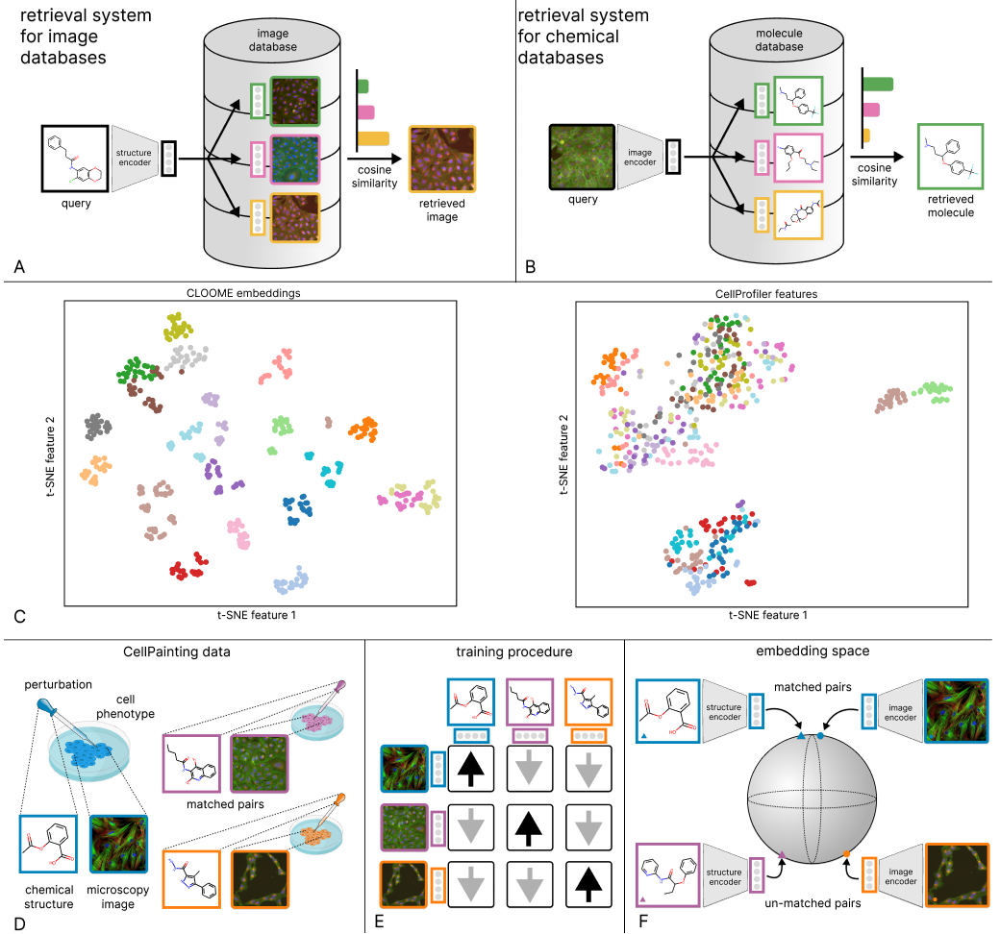

# Contrastive learning of image- and structure-based representations in drug discovery

This repository contains the code for training and testing CLOOME, which is developed on the code basis of [CLOOB](https://github.com/ml-jku/cloob). Weights for the trained CLOOME can be downloaded here: https://huggingface.co/anasanchezf/cloome/tree/main.
Embeddings of all images in the CellPainting dataset can be found here: https://huggingface.co/anasanchezf/cloome/blob/main/image_embeddings.zip

The data used for training is the subset of treated cells from the Cell Painting dataset (http://gigadb.org/dataset/100351; see download instructions here https://github.com/gigascience/paper-bray2017). Pre-processed images from this dataset can be found at https://ml.jku.at/software/cellpainting/dataset/. 

## Abstract
Contrastive learning for self-supervised representation learning has brought a strong improvement to many application areas, such as computer vision and natural language processing. With the availability of large collections of unlabeled data in vision and language, contrastive learning of language and image representations has shown impressive results. The contrastive learning methods CLIP and CLOOB have demonstrated that the learned representations are highly transferable to a large set of diverse tasks when trained on multi-modal data from two different domains. In life sciences, similar large, multi-modal datasets comprising both cell-based microscopy images and chemical structures of molecules are available.

However, contrastive learning has not yet been used for this type of multi-modal data, although this would allow to design cross-modal retrieval systems for bioimaing and chemical databases. In this work, we present a such a contrastive learning method, the retrieval systems, and the transferability of the learned representations. Our method, Contrastive Learning and leave-One-Out-boost for Molecule Encoders (CLOOME), is based on both CLOOB and CLIP and comprises an encoder for microscopy data, an encoder for chemical structures and a contrastive learning objective, which produce rich embeddings of bioimages and chemical structures. 

On the benchmark dataset ”Cell Painting”, we demonstrate that the embeddings can be used to form a retrieval system for bioimaging and chemical databases. We also show that CLOOME learns transferable representations by performing linear probing for activity prediction tasks. Furthermore, the image embeddings can identify new cell phenotypes, as we show in a zero-shot classification task. 

A pre-print is available [here](https://openreview.net/forum?id=OdXKRtg1OG).

