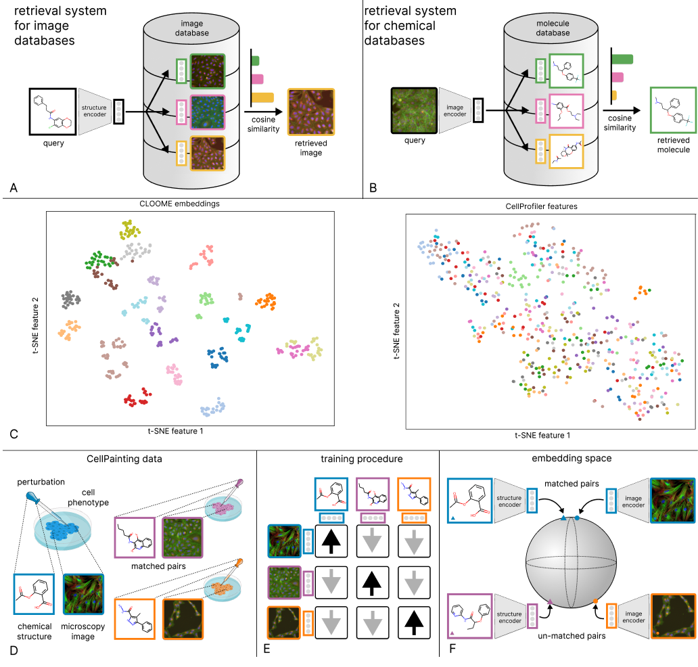

# Contrastive learning of image- and structure based representations in drug discovery

Paper is available [here](https://openreview.net/pdf?id=OdXKRtg1OG).

This repository will contain the necessary code for reproducing the results shown in the paper. It is an application of [CLOOB](https://arxiv.org/pdf/2110.11316.pdf) and [CLIP](https://arxiv.org/pdf/2103.00020.pdf) for drug discovery, using fluorescence microscopy images and molecular structures. It is based on the implementation of [CLOOB](https://github.com/ml-jku/cloob).

## Abstract
Contrastive learning for self-supervised representation learning has brought a strong improvement to many application areas, such as computer vision and natural language processing. With the availability of large collections of unlabeled data in vision and language, contrastive learning of language and image representations has shown impressive results. The contrastive learning methods CLIP and CLOOB have demonstrated that the learned representations are highly transferable to a large set of diverse tasks when trained on multi-modal data from two different domains. In drug discovery, similar large, multi-modal datasets comprising both cell-based microscopy images and chemical structures of molecules are available.

However, contrastive learning has not yet been used for this type of multi-modal data, although transferable representations could be a remedy for the time-consuming and cost-expensive label acquisition in this domain. In this work, we present a contrastive learning method for image-based and structure-based representations of small molecules for drug discovery.

Our method, Contrastive Leave One Out boost for Molecule Encoders (CLOOME), is based on CLOOB and comprises an encoder for microscopy data, an encoder for chemical structures and a contrastive learning objective. On the benchmark dataset ”Cell Painting”, we demonstrate the ability of our method to learn transferable representations by performing linear probing for activity prediction tasks. Additionally, we show that the representations could also be useful for bioisosteric replacement tasks.
